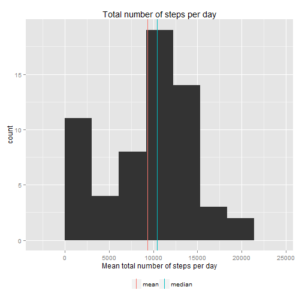
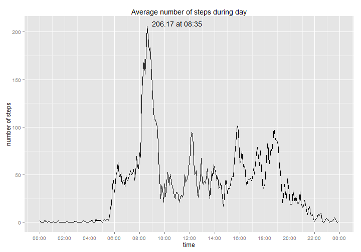
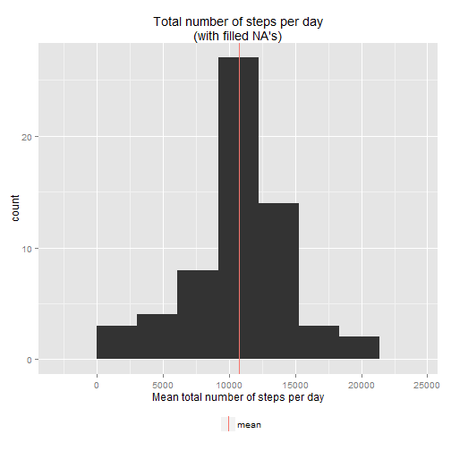
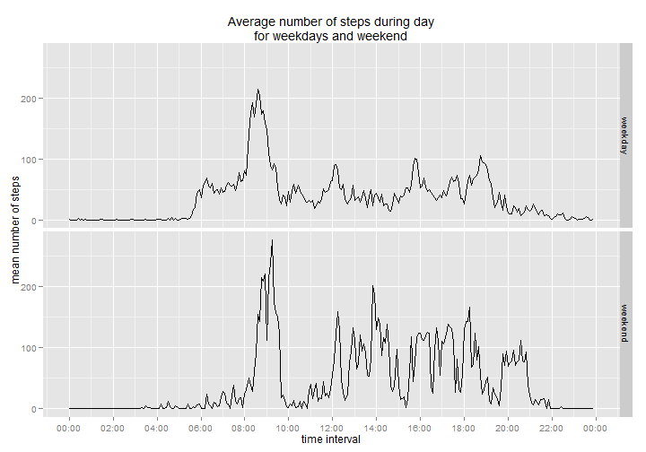

# Reproducible Research: Peer Assessment 1


## Loading and preprocessing the data

```r
d = read.csv(unz('activity.zip', 'activity.csv'))
d$date.time <- strptime(sprintf('%s %04g', d$date, d$interval), '%Y-%m-%d %H%M')
d$time <- factor(strftime(d$date.time, '%H:%M'))
d$daytype <- factor(ifelse(as.POSIXlt(d$date.time)$wday<6, 'weekday', 'weekend'))
```

## What is mean total number of steps taken per day?

```r
steps.per.day <- tapply(d$steps, d$date, sum, na.rm=T)
```
### Mean

```r
steps.per.day.mean <- mean(steps.per.day, na.rm=T)
steps.per.day.mean
```

```
## [1] 9354
```

### Median

```r
steps.per.day.median <- median(steps.per.day, na.rm=T)
steps.per.day.median
```

```
## [1] 10395
```

### Histogram

```r
k <- (log2(length(steps.per.day)) + 1)
bw <- (max(steps.per.day, na.rm=T) - min(steps.per.day, na.rm=T))/k
qplot(steps.per.day, binwidth=bw, xlab='Mean total number of steps per day') +
  geom_vline(aes(xintercept=steps.per.day.mean, color='mean'), show_guide=T) +
  geom_vline(aes(xintercept=steps.per.day.median, color='median'), show_guide=T) +
  guides(colour=guide_legend(title='')) +
  theme(legend.position='bottom') +
  ggtitle('Total number of steps per day')
```

 


## What is the average daily activity pattern?

```r
weekly.pattern <- with(d, tapply(steps, time, mean, na.rm=T))
weekly.pattern.max <- max(weekly.pattern)
```

### Max average number of steps in 5-min interval:

```r
max.label <- sprintf("%5.2f at %s", weekly.pattern.max, names(weekly.pattern)[weekly.pattern==weekly.pattern.max])
max.label
```

```
## [1] "206.17 at 08:35"
```

### Acvivity pattern

```r
xlabs <- strptime(names(weekly.pattern), '%H:%M')
weekly.pattern.max.time = xlabs[which(weekly.pattern==weekly.pattern.max)]
qplot(xlabs, weekly.pattern, geom='line') +
  scale_x_datetime(labels=date_format("%H:%M"), breaks='2 hours') +
  annotate('text', label=max.label, x=weekly.pattern.max.time, y=weekly.pattern.max, hjust=-0.1, vjust=0) +
  labs(x='time', y='number of steps',
       title='Average number of steps during day')
```

 


## Imputing missing values
### Total number of missed values

```r
sprintf('%d (%5.2f%%)', sum(is.na(d$steps)), sum(is.na(d$steps)) / nrow(d) * 100)
```

```
## [1] "2304 (13.11%)"
```

### Replacing NAs with mean value for that 5-min interval

```r
d.full <- transform(d, steps = ifelse(!is.na(steps), steps, weekly.pattern[time]))
full.steps.per.day <- tapply(d.full$steps, d.full$date, sum)
```
### Mean

```r
full.steps.per.day.mean = mean(full.steps.per.day)
full.steps.per.day.mean
```

```
## [1] 10766
```
Difference original mean: 1411.9592


### Median

```r
median(full.steps.per.day)
```

```
## [1] 10766
```
Difference with original median: 371.1887

### Histogram

```r
k <- (log2(length(full.steps.per.day)) + 1)
bw <- (max(full.steps.per.day) - min(full.steps.per.day))/k
qplot(full.steps.per.day, binwidth=bw, xlab='Mean total number of steps per day') +
  geom_vline(aes(xintercept=full.steps.per.day.mean, color='mean'), show_guide=T) +
  guides(colour=guide_legend(title='')) +
  theme(legend.position='bottom') +
  ggtitle('Total number of steps per day\n(with filled NA\'s)')
```

 

After replacing NA's in original data histogram of total number of steps taken per day looks nomal-distributed.

## Are there differences in activity patterns between weekdays and weekends?

```r
ww.pattern <- melt(with(d, tapply(steps, list(time, daytype), mean, na.rm=T)), value.name='steps')
ggplot(ww.pattern, aes(strptime(Var1, '%H:%M'), steps)) +
  geom_line() +
  facet_grid(Var2 ~ .,) +
  scale_x_datetime(labels=date_format("%H:%M"), breaks='2 hours') +
  labs(x='time interval', y='mean number of steps',
       title='Average number of steps during day\nfor weekdays and weekend') +
  theme(legend.position='bottom')
```

 
